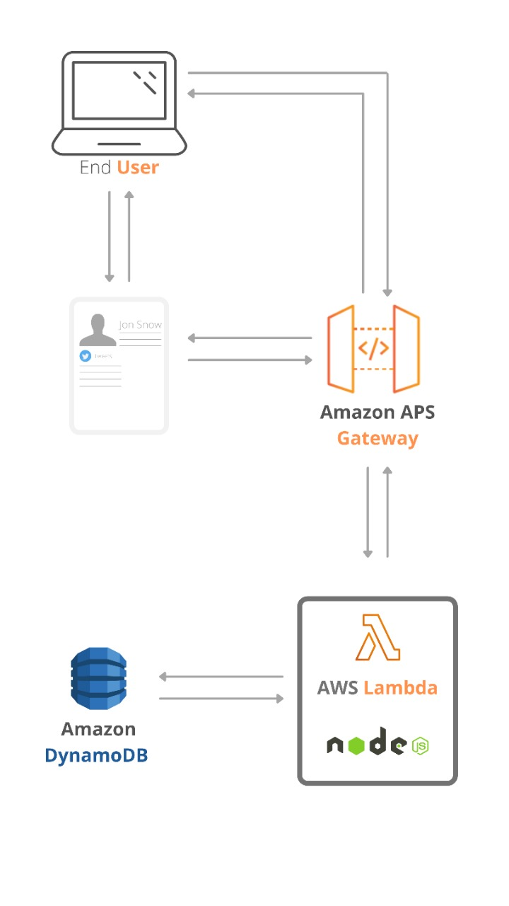

# NodeJStest

En este proyecto se creó una web app para un portafolio personal, usando tecnologías serverless usando funciones lambda en AWS. Estás funciones fueron expuestas en dos enpoints usando AWS Getway para poder ser consumidas desde la web.

  

## AWS Getway endpoints

Trae la información de los usuarios creados en la base de datos.

GET - https://cjwy613v3i.execute-api.us-east-2.amazonaws.com/PDN/portfolio

Permite editar la información del perfil como el nombre del usuario, foto y la experiencia de la persona.

PUT - https://cjwy613v3i.execute-api.us-east-2.amazonaws.com/PDN/portfolio

